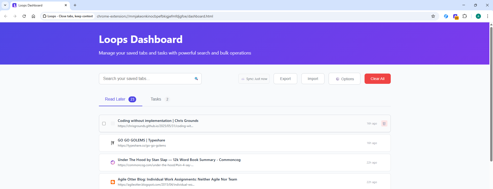
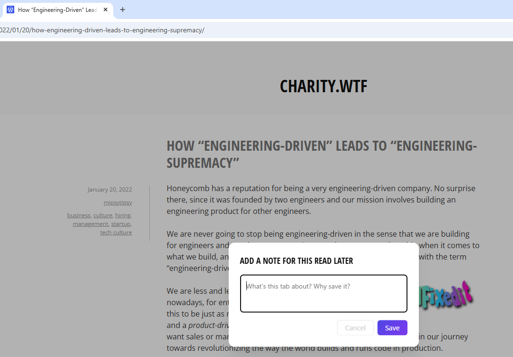
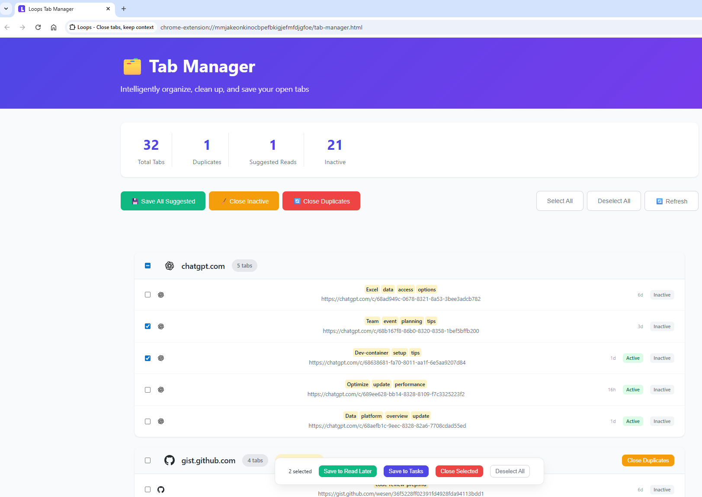
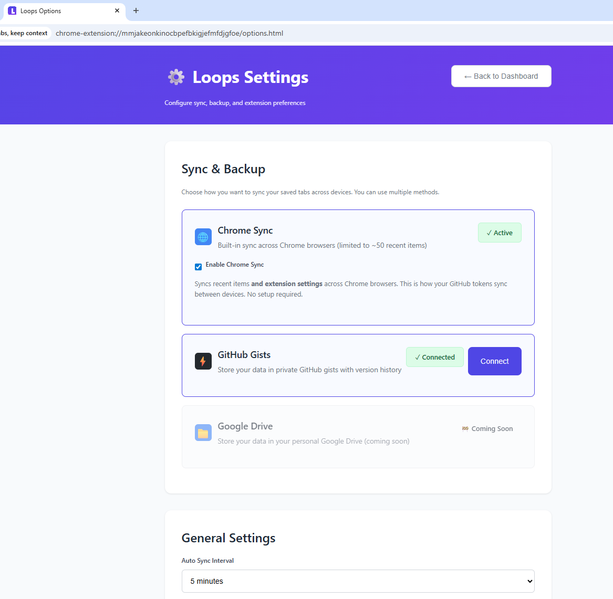

# 🚀 Chrome Web Store Listing Information

## Basic Information

**Name:** Loops - Close tabs, keep context

**Category:** Productivity

**Language:** English

## Short Description (132 characters max)

```
Manage tabs better by saving them to Read Later or Task lists. Quick save with Alt+R/Alt+T, sync across devices.
```

## Detailed Description

```
Ever opened Chrome and realized you've got 144 tabs across 13 windows, half of them duplicates, most of them things you swear you'll "definitely read this weekend"? I've been there. If you haven't I honestly don't think you need this.

Chrome's built-in Ctrl+Shift+a is nice, but I still ended up opening the same Stack Overflow answer, documentation page, or "urgent" Slack thread 3 times because I couldn't remember which window it was hiding in or if it was open at all.

That's why I built Loops—a lightweight tab manager that finally let me drop from 144 tabs to just 24 in minutes as soon as I tried it (bonus: the badge turns a satisfying green when you get below 25 🧘‍♂️).

✨ What Loops Does for Your Tab Addiction

💾 Save instantly with shortcuts:
• Alt+R → "Read Later" (for that blog post you'll totally read)
• Alt+T → "Tasks" (for things that you really will take action on)

📝 Add context with quick notes [Alt+Shift+R/T] (so future-you remembers why you saved "localhost:3000" at 2 AM)

🔍 Find duplicates & group by domain to realize you had 15 GitHub tabs open (again)

☁️ Cross-device sync via Chrome or GitHub Gists (your accounts, your data, your chaos)

🧹 Clean Lists page with bulk actions, search, and the sweet satisfaction of hitting "Delete All"

💡 Why It's Different

✅ Finally close tabs without that nagging "but what if I need this" anxiety
✅ Catch duplicates before you end up with 8 tabs of the same Reddit thread
✅ Actually fast and lightweight (not another RAM-hungry productivity monster)
✅ Privacy-first: data lives in YOUR Chrome/GitHub, not on some random server

🚀 Perfect For

👩‍💻 Developers juggling GitHub, GitLab, localhost, and 47 documentation sites
🎓 Students collecting "research" (aka procrastination material)
🗂️ Anyone whose browser looks like a digital hoarder's paradise
🤔 People who've ever said "I know I had that tab open somewhere..."

Open source. Built by a reformed tab hoarder. Powered by the existential dread of losing important tabs.

👉 Save, sync, and finally close those tabs. Loops is the tab intervention I wish someone had staged for me years ago.
```

## Screenshots

### 📸 **Screenshot 1: Lists Page**



Shows the Lists page with saved tabs in both "Read Later" and "Tasks" lists, highlighting the clean, modern interface with sample saved items and favicons.

### 📸 **Screenshot 2: Note-Taking Dialog**



Shows the note dialog when adding context to saved tabs. Demonstrates the Alt+Shift+R functionality for adding notes - highlighting the "keep context" part of the value proposition.

### 📸 **Screenshot 3: Tab Manager View**



Shows the tab manager interface with bulk operations. Demonstrates smart organization (32 tabs, 1 duplicate, 21 inactive) and highlights bulk action buttons and cleanup features.

### 📸 **Screenshot 4: Options/Settings Page**



Displays sync configuration options (Chrome Sync, GitHub Gists) with active connection statuses. Highlights the auto-save functionality and cross-device sync capabilities.

## Icon & Assets

- Extension uses the existing icons in `/icons/` folder
- Main icon: Modern loop/infinity symbol in blue/purple gradient
- All required sizes available (16px, 32px, 48px, 128px)

## Privacy Policy

See [PRIVACY-POLICY.md](PRIVACY-POLICY.md) - emphasizes local-first approach and no data collection.

## Support & Documentation

- **GitHub Repository**: [https://github.com/asbjornb/loops-chrome-extension](https://github.com/asbjornb/loops-chrome-extension)
- **Issues/Support**: [https://github.com/asbjornb/loops-chrome-extension/issues](https://github.com/asbjornb/loops-chrome-extension/issues)
- **Release Package**: [loops-extension-v1.0.0.zip](loops-extension-v1.0.0.zip) (Ready for Chrome Web Store)

## Pricing

**Free** - No paid features, no subscriptions, no ads

## Single Purpose

Tab management and organization tool that saves open browser tabs to categorized lists (Read Later/Tasks) with optional sync across devices.

## Permissions Justification

**`tabs` - Access browser tabs**

- **Why needed**: Read tab title, URL, and favicon when user saves a tab
- **What we do**: Extract basic tab information (title, URL, icon) to create saved tab entries
- **What we DON'T do**: Never read tab content, never access browsing history, never track user behavior

**`activeTab` - Access active tab**

- **Why needed**: Get current tab information when user presses Alt+R or Alt+T shortcuts
- **What we do**: Read only the currently active tab's title and URL when explicitly saving
- **What we DON'T do**: Never access inactive tabs, never run in background on all tabs

**`storage` - Store data locally**

- **Why needed**: Save user's tab lists locally and optionally sync across their Chrome browsers
- **What we do**: Store saved tabs, user settings, and sync data using Chrome's storage API
- **What we DON'T do**: Never send data to external servers (except user's own GitHub if they choose)

**`scripting` - Run content scripts**

- **Why needed**: Show note-taking dialog when user presses Alt+Shift+R or Alt+Shift+T
- **What we do**: Inject minimal script only when user explicitly saves tab with note
- **What we DON'T do**: Never run scripts automatically, never modify page content, never track user activity

---
